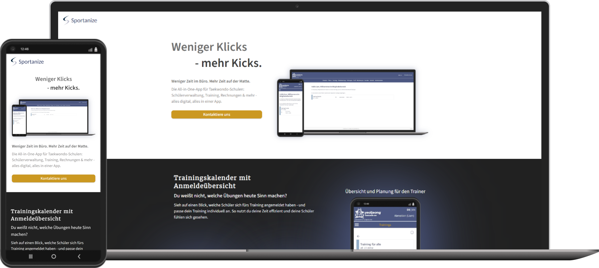

# Sportanize 

**Sportanize** ist ein digitales Tool für Taekwondo-Schulen 🥋, das Trainingsplanung, Mitgliederverwaltung und Rechnungen in einer App vereint. Entwickelt für Trainer:innen, die mehr Zeit auf der Matte verbringen möchten.

## Die wichtigsten Features
- **Trainingskalender mit Anmeldeübersicht**: Halte deine Schüler aktuell bzgl. stattfindenden Trainings & behalte den Überblick über die Anmeldungen.
- **Rechnung in wenigen Klicks**: Durch alle Informationen in einer App verschickst du in nur 5 Klicks eine Rechnung an deine Mitglieder.
- **Schülerprofile mit Foto**: Verwaltung aller deiner Mitglieder an einer zentralen Stelle
- **Inventar**: Behalte den Überblick über deine Doboks, Gürtel & sämtliches Inventar deiner Schule.
- **Statistiken**: Wieviele Mitglieder hast du? Was nimmt deine Schule monatlich ein? Mit den Statistiken siehst du alles auf einen Blick.

## Mehr erfahren

👉🏼 Besuche unsere Website für alle Infos: [www.sportanize.de](https://sportanize.de)

 

